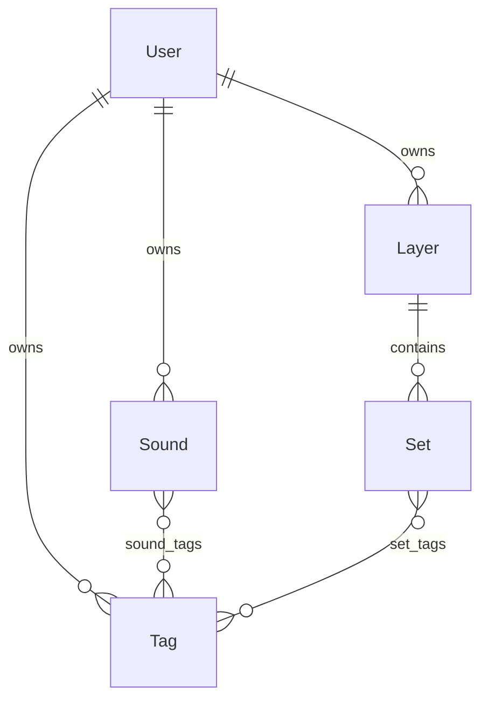

# ElectroBard — Data Model

The launch persistence model: entities, relationships, and the initial schema the M0
Alembic baseline builds. Derived from the PRDs and ADRs; the API surface over it is the
[API contract](api-contract.md).

Domain terms: [glossary](../CONTEXT.md). Build order: [roadmap](roadmap.md).
Architecture: [tech-stack](tech-stack.md) · [ADRs](adr/).

## Scope & principles

- **Launch scope only** (M0–M3). Post-MVP entities (listeners, manual sets, transitions) are
  noted where they'd attach but are **not** in the schema.
- **Multi-tenant from day one** (ADR-0002). Every owned entity carries a `user_id`; auth is
  stubbed to one implicit current user, but the ownership column exists now so hosted
  multi-tenant needs no migration of the core model.
- **Playback state is not persisted.** The Program (what's currently playing) lives in the
  controller's browser and is lost on reload (ADR-0003, PRD-04). There is **no Program table** —
  its absence is a decision, not an omission.
- **Audio never touches the DB.** Uploaded files live behind the storage interface
  (`save/get/delete` by key, ADR-0001); the DB stores only the key and metadata.

## Entity–relationship overview

**Set → Sound has no table.** A set is tag-based (PRD-03), so its members are *resolved* by
matching the set's tags against sound tags (OR semantics) — a query, not a stored link. This is
why deleting a sound "removes it from all sets" for free, and why a set can silently become
empty and stay. A `sound_set` join table only appears if/when manual sets ship (post-MVP).

## Entities

### User
The unit of data ownership. Minimal at launch (auth deferred); real identity/OAuth columns land
with the auth milestone.

| Field | Type | Notes |
|---|---|---|
| `id` | UUID | PK |
| `created_at` | timestamptz | |

At launch a single row is seeded (or lazily created) and every request resolves to it.

### Sound
One library entry, backed by exactly one audio source. The file/YouTube split is modeled as
**single-table** (a `kind` discriminator + nullable type-specific columns) — cleanest for two
variants; revisit joined-table inheritance only if source types multiply.

| Field | Type | Notes |
|---|---|---|
| `id` | UUID | PK |
| `user_id` | UUID | FK → User |
| `name` | text | Display label; the key sets order by (A→Z). Seeded from oEmbed (YouTube) or filename (file); **GM-editable at any time** for both kinds. |
| `kind` | enum(`file`,`youtube`) | Audio-source discriminator |
| `duration_seconds` | int | nullable, best-effort (library-UI track length). **file:** probed server-side at upload via mutagen (`info.length`); null if unparseable — upload still succeeds (ADR-0006). **youtube:** null at add-time (keyless oEmbed carries no duration, ADR-0005); optional client-side IFrame `getDuration()` backfill post-M1. |
| `is_errored` | bool | default false — machine skip-flag, set at runtime by the client IFrame `onError` (`101`/`150` embed-disabled, `100` gone/private); add-time is only a heuristic warning (ADR-0005). **The column + read-contract are M1, but the write path is M3 (#25)** — nothing in M1 writes it `true`, so an M1 sound is always `false` in practice. Only the YouTube playback path ever sets it; **file sounds are never errored** at launch (bytes are ours). No `CHECK` tying it to `kind`. |
| `error_detail` | text | nullable — human-readable sentence for GM display; M3 populates it (the `onError`-code → text vocabulary is designed then, not at M1). |
| `storage_key` | text | `file` only — key into the storage interface; `sounds/{id}.{ext}` (blob reuses the Sound PK), set at upload (#22) |
| `content_type` | text | `file` only — canonical type from the upload extension-allowlist (`audio/mpeg`·`audio/ogg`·`audio/wav`·`audio/mp4`·`audio/flac`); client `Content-Type` not trusted (#22) |
| `youtube_video_id` | text | `youtube` only |
| `created_at` | timestamptz | |

Integrity: exactly the columns for `kind` are populated (app-enforced; optionally a CHECK
constraint). Deleting a Sound also deletes its file via the storage interface (side effect
outside the DB).

### Tag
A free-form label owned by a User; drives set composition.

| Field | Type | Notes |
|---|---|---|
| `id` | UUID | PK |
| `user_id` | UUID | FK → User |
| `name` | text | unique per user — `UNIQUE(user_id, name)` |
| `created_at` | timestamptz | |

### Layer
A named, independently-mixed channel. Three starter layers (music, ambience, sound effects) are
seeded on first run as **ordinary rows** — no special-casing.

| Field | Type | Notes |
|---|---|---|
| `id` | UUID | PK |
| `user_id` | UUID | FK → User |
| `name` | text | |
| `position` | int | Manual display order (GM-arranged, PRD-02). Layers render `ORDER BY position`; reordering rewrites the affected rows. Dense 0-based integers at launch — trivially small lists. |
| `playback_mode` | enum(`single`,`multiset`,`self_stacking`) | default `single`; `self_stacking` is the multiset refinement |
| `volume` | int | 0–100 percent; default **80**. Divide by 100 when handing to Howler (0.0–1.0). |
| `created_at` | timestamptz | |

### Set
A tag-composed group of sounds within one Layer, triggered as a unit.

| Field | Type | Notes |
|---|---|---|
| `id` | UUID | PK |
| `layer_id` | UUID | FK → Layer (owner resolves via the layer) |
| `name` | text | |
| `position` | int | Manual display order within the layer (GM-arranged). Sets render `ORDER BY position`; reordering rewrites the affected rows. Dense 0-based integers at launch — trivially small lists. |
| `loop` | bool | default false (PRD-03) |
| `shuffle` | bool | default false; re-shuffles each loop (runtime concern) |
| `created_at` | timestamptz | |

*Post-MVP:* set-to-set auto-advance ("then play …") attaches as a nullable self-FK
`next_set_id → Set`; additive, no migration of existing rows. Deferred (transitions are post-MVP).

### Join tables
- **`sound_tags`** — `(sound_id, tag_id)` composite PK. Sound ↔ Tag many-to-many.
- **`set_tags`** — `(set_id, tag_id)` composite PK. Set ↔ Tag many-to-many; one or more tags per
  set, matched OR.

## Relationships & cardinality

| Relationship | Cardinality | Delete behavior |
|---|---|---|
| User → Sound / Tag / Layer | 1 → many | cascade (owner teardown; future concern) |
| Layer → Set | 1 → many | cascade — deleting a layer deletes its sets |
| Sound ↔ Tag (`sound_tags`) | many ↔ many | delete Sound or Tag → its join rows go |
| Set ↔ Tag (`set_tags`) | many ↔ many | delete Set or Tag → its join rows go |
| Set → Sound (membership) | derived via shared tags | not stored; recomputed on read |

Deleting a **Tag** drops it from both join tables; a set that loses its last tag resolves to
empty and is kept (PRD-03).

## Tenant scoping

`Sound`, `Tag`, and `Layer` carry `user_id` directly; `Set` is scoped **through its Layer**
(normalized — no denormalized `user_id` on Set at launch). Every list/read query filters by the
current user. If join-through scoping proves awkward under real auth, denormalizing `user_id`
onto `Set` is a cheap additive migration.

## Cross-cutting conventions

- **UUID primary keys** everywhere — non-enumerable and merge-safe for the hosted multi-tenant
  future, at the cost of readability in raw tables.
- **`created_at`** (timestamptz) on all first-class entities — cheap audit + enables recently-added
  sort. **No `updated_at` at launch** (nothing reads it; additive later if caching/sync/"recently
  edited" arrives).
- **Hard deletes** — rows are physically removed (`DELETE`), not flagged. No trash/undo/audit at
  launch; a delete is final (guard with a confirm dialog in the UI). Soft-delete (`deleted_at` +
  query filters) is revisited only if history/restore is ever needed.
- **Enums** (`kind`, `playback_mode`) as native Postgres enums or a checked text column —
  settled at M0.

## Open questions

Tracked in the [risks & open-questions log](risks.md):

- Native Postgres enums vs. checked text for `kind` / `playback_mode` (leaning checked text).
- Whether `Set.position` is enough for session-view ordering or grouping metadata is needed.

## Realization

The M0 Alembic baseline migration creates these tables; each later milestone adds only what its
features need (M1: Sound/Tag + `sound_tags`; M2: Layer/Set + `set_tags`). SQLAlchemy models
mirror this 1:1 (tech-stack).
