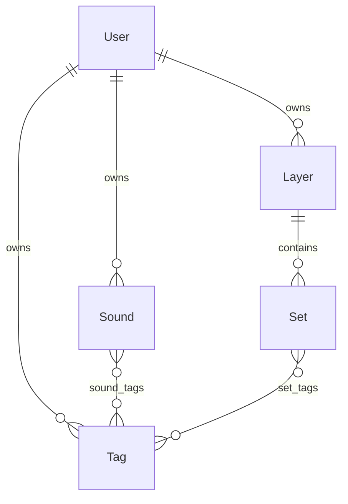

# ElectroBard — Data Model

The launch persistence model: entities, relationships, and the initial schema the M0
Alembic baseline builds. Derived from the PRDs and ADRs; the API surface over it is the
[API contract](api-contract.md).

Domain terms: [glossary](../CONTEXT.md). Build order: [roadmap](roadmap.md).
Architecture: [tech-stack](tech-stack.md) · [ADRs](adr/).

## Scope & principles

- **Launch scope only** (M0–M3). Post-MVP entities (listeners, manual sets, transitions) are
  noted where they'd attach but are **not** in the schema.
- **Multi-tenant from day one** (ADR-0002). Every owned entity carries a `user_id`; auth is
  stubbed to one implicit current user, but the ownership column exists now so hosted
  multi-tenant needs no migration of the core model.
- **Playback state is not persisted.** The Program (what's currently playing) lives in the
  controller's browser and is lost on reload (ADR-0003, PRD-04). There is **no Program table** —
  its absence is a decision, not an omission.
- **Audio never touches the DB.** Uploaded files live behind the storage interface
  (`save/get/delete` by key, ADR-0001); the DB stores only the key and metadata.

## Entity–relationship overview

```mermaid
erDiagram
    User ||--o{ Sound : owns
    User ||--o{ Tag   : owns
    User ||--o{ Layer : owns
    Layer ||--o{ Set  : contains
    Sound }o--o{ Tag  : "sound_tags"
    Set   }o--o{ Tag  : "set_tags"
```

**Set → Sound has no table.** A Set is tag-based (PRD-03), so its members are *resolved* by
matching the Set's Tags against Sound Tags (OR semantics) — a query, not a stored link. A matching
Sound occurs once by identity even if several Tags match; errored Sounds remain members. This is
why deleting a Sound "removes it from all sets" for free, and why a Set can silently become empty
and stay. A `sound_set` join table only appears if/when manual Sets ship (post-MVP).

## Entities

### User
The unit of data ownership. Minimal at launch (auth deferred); real identity/OAuth columns land
with the auth milestone.

| Field | Type | Notes |
|---|---|---|
| `id` | UUID | PK |
| `created_at` | timestamptz | |
| `starter_layers_provisioned_at` | timestamptz | nullable, no DB default — null means starter-Layer provisioning has not completed; once set, it is never cleared by Layer changes or deletion |

At launch a single row is seeded (or lazily created) and every request resolves to it.

### Sound
One library entry, backed by exactly one audio source. The file/YouTube split is modeled as
**single-table** (a `kind` discriminator + nullable type-specific columns) — cleanest for two
variants; revisit joined-table inheritance only if source types multiply.

| Field | Type | Notes |
|---|---|---|
| `id` | UUID | PK |
| `user_id` | UUID | FK → User |
| `name` | text | Display label; the canonical Set-membership order key is its Unicode default case-folded value (without normalization), followed by Sound UUID. Seeded from oEmbed (YouTube) or filename (file); **GM-editable at any time** for both kinds. |
| `kind` | enum(`file`,`youtube`) | Audio-source discriminator |
| `duration_seconds` | int | nullable, best-effort (library-UI track length). **file:** probed server-side at upload via mutagen (`info.length`); null if unparseable — upload still succeeds (ADR-0006). **youtube:** null at add-time (keyless oEmbed carries no duration, ADR-0005); optional client-side IFrame `getDuration()` backfill post-M1. |
| `is_errored` | bool | default false — machine skip-flag, set at runtime after persistent client IFrame `onError` (`2`, `100`, `101`, `150`); add-time is only a heuristic warning (ADR-0005). **The column + read-contract are M1, but the write path is M3 (#88)** — nothing in M1 writes it `true`, so an M1 sound is always `false` in practice. Only the YouTube playback path ever sets it, via the `AudioSourcePlayer` seam (ADR-0007); **file sounds are never errored** at launch. No `CHECK` tying it to `kind`. |
| `error_detail` | text | nullable — server-assigned GM-facing sentence for a persistent YouTube error; null whenever `is_errored=false` (M3 contract in [api-contract.md](api-contract.md)). |
| `storage_key` | text | `file` only — key into the storage interface; `sounds/{id}.{ext}` (blob reuses the Sound PK), set at upload (#22) |
| `content_type` | text | `file` only — canonical type from the upload extension-allowlist (`audio/mpeg`·`audio/ogg`·`audio/wav`·`audio/mp4`·`audio/flac`); client `Content-Type` not trusted (#22) |
| `youtube_video_id` | text | `youtube` only |
| `created_at` | timestamptz | |

Integrity: exactly the columns for `kind` are populated (app-enforced; optionally a CHECK
constraint). Deleting a Sound also deletes its file via the storage interface (side effect
outside the DB).

### Tag
A free-form label owned by a User; drives set composition.

| Field | Type | Notes |
|---|---|---|
| `id` | UUID | PK |
| `user_id` | UUID | FK → User |
| `name` | text | unique per user — `UNIQUE(user_id, name)` |
| `created_at` | timestamptz | |

### Layer
A named, independently-mixed channel. Each User is initially provisioned with `Music`, `Ambience`,
and `Sound Effects` as **ordinary rows** — no per-Layer starter flag or special-casing. Their
canonical initial configuration is:

| `position` | `name` | `playback_mode` | `volume` |
|---:|---|---|---:|
| 0 | `Music` | `single` | 80 |
| 1 | `Ambience` | `multiset` | 80 |
| 2 | `Sound Effects` | `self_stacking` | 80 |

No starter Sets are created.

| Field | Type | Notes |
|---|---|---|
| `id` | UUID | PK |
| `user_id` | UUID | FK → User |
| `name` | text | Display label, not identity. Every write path stores the canonical form: outer Unicode whitespace removed; 1–100 Unicode code points; no characters in Unicode category `Cc`. Case and internal spaces are preserved; no Unicode normalization or case-folding. Duplicates per User are allowed — no name uniqueness constraint. |
| `position` | int | Read-only manual display order within the User (GM-arranged, PRD-02). Layers render `ORDER BY position`; the collection reorder operation is the only way to reposition existing rows. Dense 0-based integers at launch. `CHECK (position >= 0)` and `UNIQUE(user_id, position)` protect the stored range and prevent collisions. |
| `playback_mode` | enum(`single`,`multiset`,`self_stacking`) | default `single`; `self_stacking` is the multiset refinement |
| `volume` | int | 0–100 percent; default **80**. Divide by 100 when handing to Howler (0.0–1.0). |
| `created_at` | timestamptz | |

#### Starter-Layer provisioning lifecycle

The M2 migration provisions all existing Users atomically with the Layer schema. Thereafter the
explicit User-creation service inserts the User and their three starter Layers and sets
`starter_layers_provisioned_at` in one transaction. This includes the current implicit-User path
and the future authentication/signup path.

Provisioning serializes on the User row. A non-null marker makes retries successful no-ops without
examining Layer names or rows; a failed transaction leaves both marker and Layers absent. The
marker is historical completion state, not a claim that the initial Layers still exist: renaming,
reconfiguring, or deleting them never clears it and ordinary requests never recreate them. A null
marker alongside existing Layers is an invariant violation requiring explicit repair, not a state
the provisioner merges or overwrites.

### Set
A tag-composed group of sounds within one Layer, triggered as a unit.

| Field | Type | Notes |
|---|---|---|
| `id` | UUID | PK |
| `layer_id` | UUID | FK → Layer (owner resolves via the layer) |
| `name` | text | Display label, not identity. Same canonical form as Layer names. Duplicates within a Layer are allowed — no name uniqueness constraint. |
| `position` | int | Read-only manual display order within the Layer (GM-arranged). Sets render `ORDER BY position`; the Layer-scoped collection reorder operation is the only way to reposition existing rows. Dense 0-based integers at launch. `CHECK (position >= 0)` and `UNIQUE(layer_id, position)` protect the stored range and prevent collisions. |
| `loop` | bool | default false (PRD-03) |
| `shuffle` | bool | default false; re-shuffles each loop (runtime concern) |
| `created_at` | timestamptz | |

*Post-MVP:* set-to-set auto-advance ("then play …") attaches as a nullable self-FK
`next_set_id → Set`; additive, no migration of existing rows. Deferred (transitions are post-MVP).

## Persisted ordering

The launch hierarchy is the complete grouping model: a User has ordered Layers and each Layer has
ordered Sets. No additional grouping field or entity is persisted. This order drives both the M2
configuration outline and the M3 Session view. A Set cannot move to another Layer through a
reorder; reparenting is not a launch operation. Sound order within a tag-based Set and M3 runtime
shuffle are separate concerns.

Positions are dense, zero-based integers in each collection. Creating a Layer or Set appends it at
the next position; create and ordinary edit requests cannot select a position. Deleting one
compacts every following position in the same transaction. Reorder replaces the complete
collection order atomically and uses a collision-safe bulk renumbering strategy compatible with
the unique constraints. The application maintains density; the database constraints enforce
non-negative, collision-free positions.

All operations that can change Layer order serialize on the User row. All operations that can
change Set order serialize on the parent Layer row. Membership validation, append allocation,
renumbering, or delete compaction and the associated write occur in one transaction, so readers
never observe a partial order and failures preserve the previous order.

Design decision: [issue #59](https://github.com/matou/ElectroBard/issues/59).

### Join tables
- **`sound_tags`** — `(sound_id, tag_id)` composite PK. Sound ↔ Tag many-to-many.
- **`set_tags`** — `(set_id, tag_id)` composite PK. Set ↔ Tag many-to-many; zero or more tags per
  set, matched OR. Zero rows is a valid Set configuration and resolves to zero Sounds; validity is
  not represented by a separate status field.

## Relationships & cardinality

| Relationship | Cardinality | Delete behavior |
|---|---|---|
| User → Sound / Tag / Layer | 1 → many | cascade (owner teardown; future concern) |
| Layer → Set | 1 → many | cascade — deleting a layer deletes its sets |
| Sound ↔ Tag (`sound_tags`) | many ↔ many | delete Sound or Tag → its join rows go |
| Set ↔ Tag (`set_tags`) | many ↔ many | delete Set or Tag → its join rows go |
| Set → Sound (membership) | derived via shared tags | not stored; recomputed on read |

Deleting a **Tag** drops it from both join tables; a Set that loses its last Tag remains valid,
resolves to empty, and is kept (PRD-03).

## Tenant scoping

`Sound`, `Tag`, and `Layer` carry `user_id` directly; `Set` is scoped **through its Layer**
(normalized — no denormalized `user_id` on Set at launch). Every list/read query filters by the
current User. Resolved membership both locates the Set through its current-User Layer and limits
candidate Sounds to that User; a missing or wrong-tenant Set is the same `404`. If join-through
scoping proves awkward under real auth, denormalizing `user_id` onto `Set` is a cheap additive
migration.

## Cross-cutting conventions

- **UUID primary keys** everywhere — non-enumerable and merge-safe for the hosted multi-tenant
  future, at the cost of readability in raw tables.
- **`created_at`** (timestamptz) on all first-class entities — cheap audit + enables recently-added
  sort. **No `updated_at` at launch** (nothing reads it; additive later if caching/sync/"recently
  edited" arrives).
- **Hard deletes** — rows are physically removed (`DELETE`), not flagged. No trash/undo/audit at
  launch; a delete is final (guard with a confirm dialog in the UI). Soft-delete (`deleted_at` +
  query filters) is revisited only if history/restore is ever needed.
- **Enums** (`kind`, `playback_mode`) as native Postgres enums or a checked text column —
  settled at M0.

## Open questions

Tracked in the [risks & open-questions log](risks.md):

- Native Postgres enums vs. checked text for `kind` / `playback_mode` (leaning checked text).

## Realization

The M0 Alembic baseline migration creates these tables; each later milestone adds only what its
features need (M1: Sound/Tag + `sound_tags`; M2: Layer/Set + `set_tags`). SQLAlchemy models
mirror this 1:1 (tech-stack).
